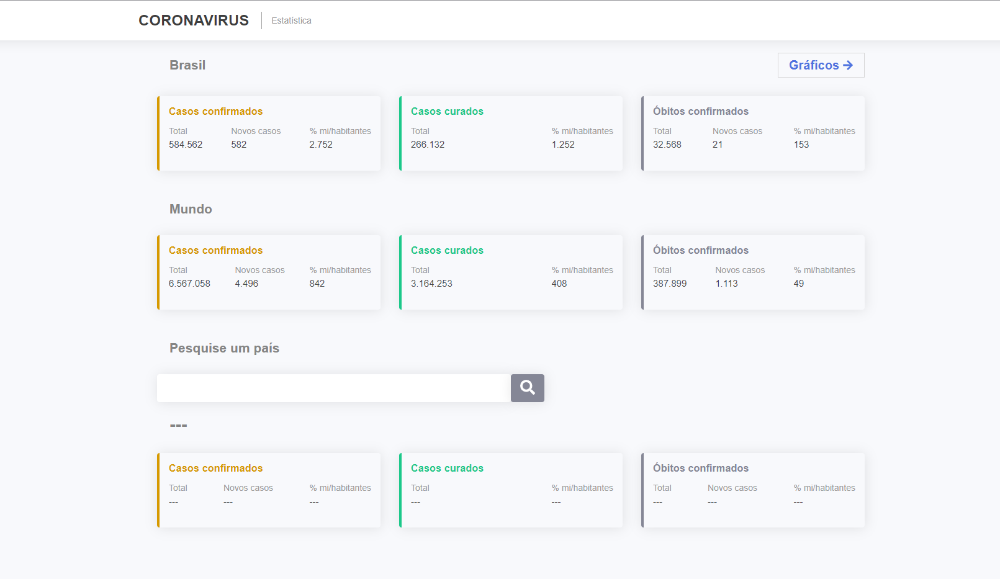
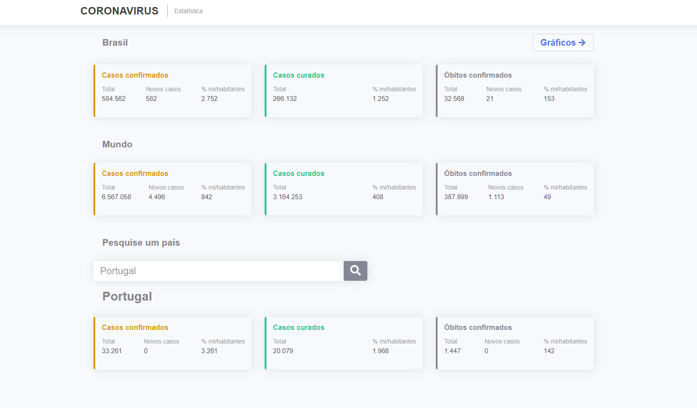
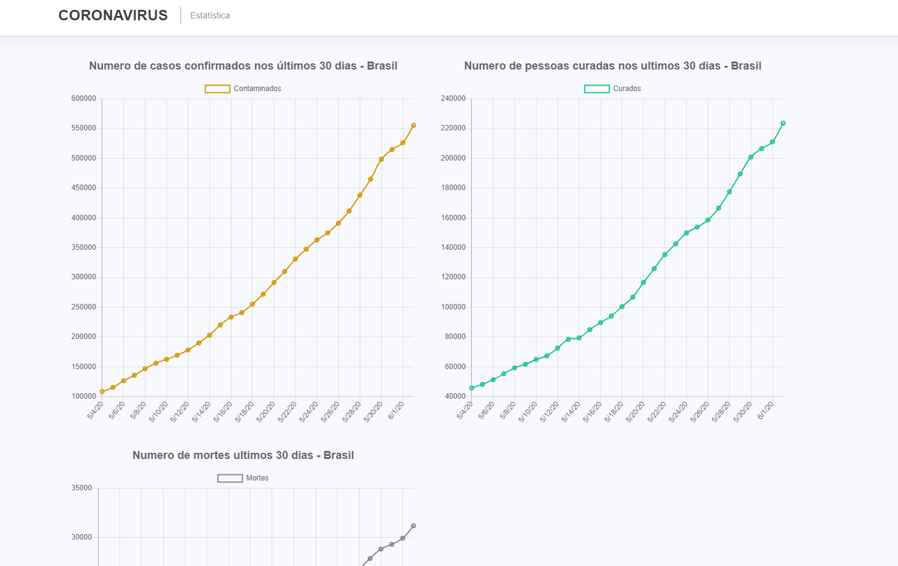

<h1 align="center">
   Coronavírus

 

<h3 align="center">

Estatisticas em tempo real
 

Consumo da API: [NovelCOVID](https://github.com/NovelCOVID/API)

</h3>
</h1>

 

- O que é o site?

  > Site é desenvolvido afim de mostrar as estatisticas em tempo real, dos dados da COVID-19 no Brasil, no mundo e também podendo buscar em um determinado pais;

- Funcionalidades:

  > Dados sobre número de casos, de curados e de óbitos da COVID-19: Brasil, mundo e países que for buscado.

  > Atualização de dados a cada 10 minutos, por uma API open-source chamada [NovelCOVID](COVIDhttps://github.com/NovelCOVID/API)

  > Página dedicada a gráficos referente aos dados da COVID-19

  ### :camera: Pagina Inicial:

  

  

  ### :camera: Gráficos:

  

  ## Tecnologias:

  - [x] Javascript
  - [x] ReactJS
  - [x] Styled-components
  - [x] react-chartjs-2
  - [x] Axios

  ## ⚙ Inicialização

  Instalar as dependências:
  > yarn
  
  Iniciar a aplicação:
  > yarn start
